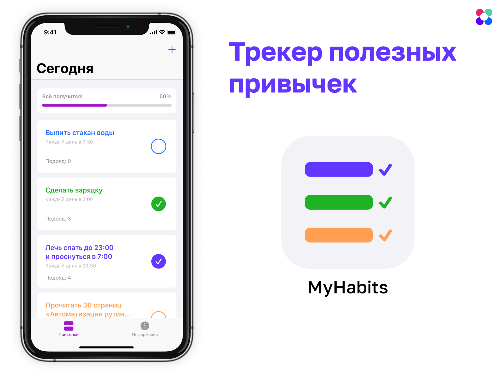

# Курсовой проект “Интерфейс приложения”

В качестве курсового проекта вы разработаете приложение "Трекер полезных привычек". Вы примените полученные знания:

- Адаптивная верстка экранов;

- Различные навигационные паттерны в iOS;

- Использование и настройка визуальных компонентов;

- Использование UITableView, UICollectionView и кастомных ячеек.

  <p align="center" width="100%">
     
  </p>

## Требования к проекту

- Проект должен запускаться без ошибок;
- Для верстки используется Auto Layout;
- Верстка приложения реализована либо в коде, либо в Interface Builder;
- Верстка приложения адаптивная, интерфейс выглядит хорошо на различных устройствах, в том числе на iPad;
- Код проекта написан в одном стиле. Обратите внимание на названия классов, переменных и функций.

## Работа с данными

Для того, чтобы создавать, сохранять и получать добавленные привычки, нужно использовать файл [HabitsStore.swift](./HabitsStore.swift). Он содержит два класса:

- Класс Habit позволяет сохранять и обновлять данные для одной привычки: название, цвет, время выполнения и т.д.;

- Класс HabitsStore позволяет сохранять и получать сохранённые привычки. Для использования HabitsStore в разных модулях приложения нужно использовать [HabitsStore.shared](https://github.com/netology-code/iosui-diplom/blob/054f1f15e9ccd8d8dc7b938c367a04010d4778a7/HabitsStore.swift#L92) свойство, например:

  ```swift
  let store = HabitsStore.shared
  print(store.habits) // распечатает список добавленных привычек
  ```

Привычки, добавленные в HabitsStore, сохраняются между перезапусками приложения автоматически.

Классы Habit и HabitsStore содержат все данные, необходимые для отображения в приложении. Внимательно изучите интерфейсы этих классов и документацию перед работой над проектом.

## Работа с дизайном

Макеты всех экранов находятся в [Figma](https://www.figma.com/file/LSFWbwp1h8uAZ6NVbSyjHZ/Habit-tracker-Figma-Interactive). Все стили текста и цвета приложения располагаются на отдельном слое [UI Kit](https://www.figma.com/file/LSFWbwp1h8uAZ6NVbSyjHZ/Habit-tracker-Figma-Interactive?node-id=101%3A2808). В реализации навигации приложения вам поможет интерактивный [прототип](https://www.figma.com/proto/LSFWbwp1h8uAZ6NVbSyjHZ/Habit-tracker-Figma-Interactive?scaling=scale-down&page-id=0%3A1&node-id=101%3A1882).

## Реализация проекта

С помощью приложения "Трекер полезных привычек" пользователи смогут добавлять полезные привычки и следить за прогрессом их выполнения.

### Создание проекта

1. Создайте iOS-проект и назовите его MyHabits, добавьте поддержку iPad.
2. Добавьте [иконку приложения](./Assets/AppIcon.appiconset) и обновите LaunchScreen согласно макетам.
3. Добавьте класс [HabitsStore.swift](./HabitsStore.swift).
4. Проверьте, что проект собирается без ошибок.

### Добавление базовой навигации

1. Добавьте таб бар с двумя контроллерами:

- HabitsViewController для отображения привычек;

- InfoViewController для отображения информации о привычках.

Вёрстку самих экранов нужно будет сделать в следующих шагах.

2. На экране HabitsViewController добавьте кнопку "Добавить" согласно макетам.

### Добавление экрана с информацией

1. На экран InfoViewController добавить информацию о привычках согласно макетам. Если текст не влезает на экран, он должен скроллиться.

2. Весь контент на экране должен скроллиться.

### Добавление новой привычки

1. Добавьте экран HabitViewController с версткой согласно макетам.

2. При нажатии на кнопку "Добавить" на экране HabitsViewController должен модально открываться HabitViewController.

   *Не создавайте UINavigationBar программно. Используйте UINavigationController для отображения навигейшн бара.*

3. При нажатии на цветной круг должен открываться [UIColorPickerViewController](https://developer.apple.com/documentation/uikit/uicolorpickerviewcontroller). Когда пользователь выбирает цвет, кружок должен отображать новый выбранный цвет. При следующем показе UIColorPickerController в нём должен быть выбран текущий цвет.

4. При нажатии на кнопку "Создать" нужно создать новый экземпляр класса Habit и сохранить его в HabitsStore, например:

```swift
let newHabit = Habit(name: "Выпить стакан воды перед завтраком",
                     date: Date(),
                     color: .systemRed)
let store = HabitsStore.shared
store.habits.append(newHabit)
```

Для сохранения данных о привычке нужно использовать свойства, которые пользователь задал с помощью элементов интерфейса: UITextField, UIView с заданным backgroundColor, UIDatePicker.

5. После сохранения новой привычки экран HabitViewController должен закрываться.

### Список добавленных привычек

1. На экран HabitsViewController добавьте UICollectionView, которая должна показывать:

- Ячейку ProgressCollectionViewCell, которая показывает прогресс за сегодняшний день. Данные для отображения можно получить из свойства [HabitsStore.shared.todayProgress](https://github.com/netology-code/iosui-diplom/blob/054f1f15e9ccd8d8dc7b938c367a04010d4778a7/HabitsStore.swift#L111);

- Ячейки HabitCollectionViewCell для показа добавленных привычек. Данные о привычках можно получить из свойства [HabitsStore.shared.habits](https://github.com/netology-code/iosui-diplom/blob/054f1f15e9ccd8d8dc7b938c367a04010d4778a7/HabitsStore.swift#L95).


2. Цветной круг в ячейке привычки показывает, была ли сегодня затрекана привычка. При нажатии на круг должно измениться его состояние (заливка цветом и иконка галочки). Также нужно сохранить время привычки с помощью функции [HabitsStore.shared.track()](https://github.com/netology-code/iosui-diplom/blob/054f1f15e9ccd8d8dc7b938c367a04010d4778a7/HabitsStore.swift#L139). Каждый день можно добавить только одно время для одной привычки. Проверить это условие можно с помощью свойства [isAlreadyTakenToday](https://github.com/netology-code/iosui-diplom/blob/054f1f15e9ccd8d8dc7b938c367a04010d4778a7/HabitsStore.swift#L39).
3. Прогресс в ProgressCollectionViewCell должен всегда показывать актуальное состояние и обновляться при добавлении времени любой привычки.
4. После добавления новой привычки и закрытия HabitViewController новая привычка должна появляться в списке.

### Показ данных о выбранной привычке

1. Добавьте HabitDetailsViewController с вёрсткой согласно макетам. Список нужно сделать с помощью UITableView. Данные для списка можно получить из свойства [HabitsStore.shared.dates](https://github.com/netology-code/iosui-diplom/blob/054f1f15e9ccd8d8dc7b938c367a04010d4778a7/HabitsStore.swift#L102). Для того, чтобы показать, была ли привычка затрекана в дату из списка, нужно использовать функцию [HabitsStore.shared.habit(_:isTrackedIn:)](https://github.com/netology-code/iosui-diplom/blob/054f1f15e9ccd8d8dc7b938c367a04010d4778a7/HabitsStore.swift#L158).


### Редактирование и удаление добавленной привычки

1. При нажатии на кнопку "Править" на экране HabitDetailsViewController должен показываться экран HabitViewController с заполненной информацией о выбранной привычке.

2. Пользователь может менять данные, при нажатии на кнопку "Сохранить" экран также должен закрываться, но в `HabitsStore` не должно появляться новой привычки, нужно обновить данные выбранной привычки. При изменении названия привычки на экране HabitDetailsViewController должно показываться актуальное название.

3. При нажатии на кнопку "Отменить" экран HabitViewController должен закрываться. Изменённые данные привычки не должны быть сохранены, даже если пользователь изменял данные на экране.

4. Внизу экрана HabitViewController должна отображаться кнопка "Удалить привычку". Кнопка должна отображаться, только если мы редактируем ранее добавленную привычку.

5. При нажатии на кнопку нужно показать UIAlertController со следующими параметрами:

- Заголовок "Удалить привычку";
- Сообщение "Вы хотите удалить привычку "название выбранной привычки"?";
- Два Alert Actions:
  - "Отмена", который закрывает UIAlertController;
  - "Удалить", при нажатии на который привычка удаляется из `HabitsStore`, экраны HabitViewController и HabitDetailsViewController закрываются и привычка пропадает из списка на экране MyHabitsViewController.

## Отправка работы на проверку

Чтобы отправить работу на проверку, загрузите репозиторий на [Github](https://github.com/).

### Как правильно задавать вопросы дипломному руководителю?

**Что поможет решить большинство частых проблем:**
1. Перед началом работы над проектом необходимо договориться с дипломным руководителем как вы будете сдавать работу на проверку: частями или полностью, файлом или через PR, а также обсудить все вопросы, чтобы не было недопонимания в будущем. 
2. При возникновении вопросов попробовать найти ответ сначала самому в интернете. Умение искать ответы пригодится вам в профессиональной деятельности. После самостоятельного поиска можно спрашивать руководителя.
3. Если вопросов больше одного, то присылайте их в виде нумерованного списка. Так дипломному руководителю будет проще отвечать на каждый из них.
4. При необходимости прикрепите к вопросу скриншоты и стрелочкой покажите, где не получается. Программу для этого можно скачать [здесь](https://app.prntscr.com/ru).
5. Распределяйте нагрузку, планируйте время на обучение и начинайте работу над дипломом как можно раньше, чтобы у вас было больше времени на правки и доработку проекта.

**Что может стать источником проблем:**
1. Вопросы вида "Ничего не работает/не запускается/всё сломалось". Руководитель не сможет ответить на такой вопрос без дополнительных уточнений. Цените своё время и время других.
2. Откладывание диплом на последний момент.
3. Ожидание моментального ответа на свой вопрос. Руководители — работающие разработчики, которые кроме преподавания занимаются рабочими проектами. Их время ограничено, поэтому постарайтесь задавать правильные вопросы, чтобы получать быстрые ответы.
